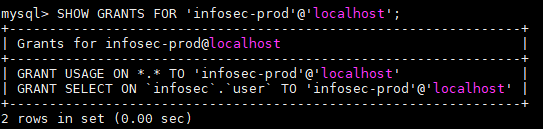

# Mysql 安全配置

## 1.账号安全

### 1.1.创建开发账号

创建 `infosec-dev` 账号，允许特定ip网络内的远程连接。

```mysql
CREATE USER 'infosec-dev'@'%' IDENTIFIED BY 'xxxxxxxx';
```

只授予 `infosec` 数据库的 `user` 表格的 `SELECT` 权限，保持最小权限原则。

```mysql
GRANT SELECT ON `infosec`.`user` TO 'infosec-dev';
FLUSH PRIVILEGES;
```

查看该账户拥有的权限：

```mysql
SHOW GRANTS FOR 'infosec-dev';
```


### 1.2.创建生产环境账号

创建 `infosec-prod` 账号，只允许localhost访问，该账号提供给同一台服务器上的infosec应用访问数据库。

```mysql
CREATE USER 'infosec-prod'@'localhost' IDENTIFIED BY 'xxxxxxxx';
```

只授予 `infosec` 数据库的 `user` 表格的 `SELECT` 权限，保持最小权限原则。

```mysql
GRANT SELECT ON `infosec`.`user` TO 'infosec-prod'@'localhost';
FLUSH PRIVILEGES;
```

查看该账户拥有的权限：

```mysql
SHOW GRANTS FOR 'infosec-prod';
```





