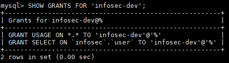
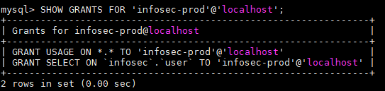

# Report

[TOC]

## 1.通信安全

lowsec系统使用spring boot框架搭建，要保证应用的通信安全，可为spring boot配置https连接。spring boot框架内置tomcat，tomcat服务器所需的数字证书可使用JDK提供的keytools工具创建。keystore是一个数字证书存放仓库。仓库的基本组成要素是key，1个key可以是一对公私密钥，也可以是一份数字证书与对应的私钥。为spring boot配置https的简略操作步骤如下所述：

1. 使用keytools创建工具创建ca.crt，keystore.jks
2. 生成服务器证书server.crt，将server.crt和对应私钥导入keystore.jks
3. 使用keystore.jks文件配置spring boot：

```properties
server.ssl.key-store=classpath:keystore.jks
server.ssl.key-store-password=${PASSWORD}
server.ssl.key-alias=${server_CN}
server.ssl.key-password=${PASSWORD}
server.ssl.enabled=true
```

4. 为客户端浏览器安装ca.crt证书
5. 将http请求重定向至https

完成以上步骤后，即可实现客户端与lowsec系统的HTTPS加密通信，保证通信安全。


## 2.业务安全

### 2.1.Spring Security表单验证与角色访问控制

#### A.spring security 关键配置类

1. 继承 WebSecurityConfigurerAdapter，并重写 configure 方法。
2. 在 configure 方法中，可以配置：
   - url 权限控制，例如一些 web 页面我们可以只允许系统管理员访问，一些页面只允许登陆用户访问，而另一些页面允许没有登陆的用户访问。
   - 指定认证方式，例如基本认证、表单认证等等。
3. 本次项目中，关键配置如下：

```java
@Override
protected void configure(HttpSecurity http) throws Exception
{
    http
        .authorizeRequests()
        .antMatchers("/", "/index").permitAll()
        .antMatchers("/users").hasRole("ADMIN")
        .anyRequest().authenticated()
    .and()
        .formLogin()
        .loginPage("/login")
        .permitAll()
    .and()
        .logout()
        .permitAll();
}
```

4. 此外，该项目采用了 thymeleaf 的模板引擎，对于一些特定的 url 例如 "/"，"/index"，"/login"，我们需要返回对应的 html 页面。一般都会在 controller 中编写对应的方法，方法返回一个 View，但是有更简单的配置：

```java
@Configuration
public class MvcConfig implements WebMvcConfigurer {

    public void addViewControllers(ViewControllerRegistry registry) {
        registry.addViewController("/index").setViewName("index");
        registry.addViewController("/").setViewName("index");
        registry.addViewController("/login").setViewName("login");
    }

}
```

#### B.获取登陆用户的信息

1. spring security 中将登陆用户的信息交给 SecurityContextHolder 管理，因此可以通过 SecurityContextHolder 来获取登陆用户的信息。

```java
SecurityContextHolder.getContext().getAuthentication();
```

#### C.RBAC 实现

1. 在上一小节中已经实现了“仅管理员可以访问获取系统用户列表的接口”和所有用户都可以访问 index 和 login 页面，其它的所有页面都需要经过验证的步骤。可以看到使用 spring security 非常简单。

```java
http
    .authorizeRequests()
    .antMatchers("/", "/index").permitAll()
    .antMatchers("/users").hasRole("ADMIN")
    .anyRequest().authenticated()
```

	所有用户都可以访问 index 页面：


	只有管理员可以调用 /users 接口：


2. 对于“查看用户详细信息”接口，由于登陆用户都可以访问，只是调用接口可获得数据的集合不一样。例如，对于管理员用户来说，可以访问到任意一个用户的信息；而对于一般用户，只能访问到自己的信息，这一部分就不能直接配置了。为了业务处理的更加灵活，直接在业务层中进行这方面的权限判断。

```java
    @GetMapping("/user/{id}")
    public String getUser(@PathVariable("id") String id, ModelMap model){
        Authentication info = SecurityContextHolder.getContext().getAuthentication();
        if (!(info instanceof AnonymousAuthenticationToken)) {
            CustomUser user = (CustomUser) info.getPrincipal(); // 获取当前登陆用户的信息
            // 获取用户的权限
            Collection<? extends GrantedAuthority> authorities = info.getAuthorities();
            // 判断用户是否为 ROLE_ADMIN 角色
            boolean sign = false;
            for (GrantedAuthority authority : authorities) {
                if (authority.getAuthority().equals(Roles.ROLE_ADMIN.getRole())) {
                    sign = true;
                    break;
                }
            }
            // 如果是 ROLE_ADMIN，根据要求不对查看的用户 id 设限，因此可以保留原来id
            // 如果不是，那么只可以查看自己的信息，因此将自己的 id 覆盖 id 变量
            id = sign ? id : user.getId() + "";
        }
        
        // 根据 id 查找数据库获取用户信息并返回
        // ...
}
```

	管理员调用 /user/5040 接口（5040 为用户 test 的 id），可以正常返回：


	普通用户 mulan 调用 /user/5040 接口，返回的只是自己的信息：


#### D.订制错误页面

1. 我们可以根据实际需求，订制对应的系统错误页面，以本实验为例子，订制简单的 error.html，403.html，404.html 页面，实现也十分简单，只需要实现 ErrorController，在发生错误时通过 Http 状态码来判断跳转页面：

```java
@Controller
public class MyErrorController implements ErrorController {

    @GetMapping("/error")
    public String handleError(HttpServletRequest request) {
        Object status = request.getAttribute(RequestDispatcher.ERROR_STATUS_CODE);

        if (status != null) {
            Integer statusCode = Integer.valueOf(status.toString());
            if(statusCode == HttpStatus.FORBIDDEN.value()) { // 没有权限访问，跳转 403.html
                return "403";
            } else if(statusCode == HttpStatus.NOT_FOUND.value()) { // 页面不存在，跳转 404.html
                return "404";
            }
        }
        return "error"; // 其它错误都默认返回 error.html
    }

    @Override
    public String getErrorPath() {
        return "/error";
    }
}
```

	订制的 403 页面（普通用户权限不够）：


	订制的 404 页面：


### 2.2.防止sql注入

1. SQL注入攻击指的是通过构建特殊的输入作为参数传入Web应用程序，而这些输入大都是SQL语法里的一些组合，通过执行SQL语句进而执行攻击者所要的操作。假设在 java 程序中有如下代码：

```java
public User login(String username, String password) {
    // 连接数据库准备
    // ...
    
    // 构造 sql 语句准备执行
    String sql = "select * from `user` where username = " + username + " and password = " + password;
    
    // 执行 sql 语句，返回 User 对象	
}
```

	如果传入的 username 为 "root and 1 = 1 #"，传入 password 为 123456，那么 sql 语句就变成了：

```sql
select * from `user` where username = root and 1 = 1# and password = 123456
```

	由于后面 password 部分被注释了，相当于通过 username 就绕过登陆并获得了 root 的信息。

2. 在本项目中，采用 mybatis 使用 #{} 语法可以防止 sql 注入，#{} 起到了占位符的作用，例如使用 #{} 改写

```sql
select * from `user` where username = #{username} and password = #{password}
```

	还是传入和上面相同的参数，此时 sql 语句会变成：

```sql
select * from `user` where username = "root and 1 = 1#" and password = "123456"
```

	执行该 sql 语句没有危险。

### 2.3.密码改为密文存储

lowsec系统最初采用明文存储密码，一旦数据库泄漏，用户存储的原始密码都会被攻击者窃取。由于用户常常在不同信息系统使用相同的密码，所以明文密码的泄露影响到了用户在其它系统的安全性，后果非常严重。

为了规避明文密码存储的缺陷，新的设计方案为：不在数据库中直接存储明文密码，转而存储原始密码加密后的哈希值。当新用户注册时，提交的原始密码会被加密成密文存储到数据库中；而当用户登录时，提交的密码同样被加密处理，再用于与数据库中已有密文比较，若两者不同，则密码错误；若两者相同，则有极大概率登录的密码正确。


在这种设计方案下，即使数据库泄露，攻击者得到的是加密过的密文，很难从密文中解密得到用户的原始密码。尽管这种设计安全性提高了不少，但是仍有受到彩虹表攻击的危险。为了进一步增强安全性，采用“加盐”的方法，为每个用户随机生成一个固定长度的“盐值”（salt），然后用盐值和原始密码混合，再加密存储。

lowsec系统采用的具体加密算法为spring security框架提供的标准非对称加密算法BCrypt算法。BCrypt算法是一种计算开销较大的块加密算法，安全性较高。


## 3.数字证书双向验证

> 参考资料：https://www.baeldung.com/x-509-authentication-in-spring-security

在实现通信安全的基础上，客户端安装了CA证书，自然也就信任由CA签发的服务器证书。但是应用服务器仍然不能确认客户端的身份。为了利用数字证书进行服务器与客户端之间的双向认证，客户端需要拥有自己的证书，并且能够被服务器识别。为了能让服务器识别特定的客户端，在服务器维持一个truststore，存储可信数字证书的仓库，但不包含私钥。truststore包含了服务器证书以及所有lowsec系统认证的客户端的证书。为lowsec配置数字证书双向认证的流程为：

1. 签发证书
   1. CA签发服务器证书
   2. 将服务器公私密钥对导入keystore
   3. CA签发客户端证书
   4. 将服务器、所有客户端证书导入truststore

2. 用keystore和truststore配置spring boot

3. 配置spring security

```yaml
server:
  ssl:
    key-store-type: JKS
    key-store: classpath:keystore.jks
    key-store-password: ${JASYPT_KEY}
    key-alias: localhost
    key-password: ${JASYPT_KEY}
    enabled: true
    trust-store: classpath:truststore.jks
    trust-store-password: ${JASYPT_KEY}
    client-auth: need
```


### 3.1.数字证书双向认证的优缺点

优点：

1. 数字证书的密钥的安全强度远远超过用户自定义的密码强度，安全性更加有保障；
2. 由于可信数字证书都存储在truststore中，通过数字证书能轻易识别认证客户端的身份；
3. 没有忘记密码的风险；

缺点：

1. 由于truststore存储了所有可信客户端的证书，每当有新用户接入时，都需要把证书安装到truststore中。当用户规模很大时，使用这种方式会增加用户证书管理的复杂度；
2. 用户的数字证书安装在特定的物理设备上，只能使用特定的物理设备登录认证。在公共场所的互联网设施上无法使用数字证书双向认证；
3. 需要有高效的机制从truststore中撤销客户端证书；

## 4.服务器安全、操作系统安全

lowsec系统部署在阿里云ECS服务器centos7系统上，使用阿里云安全组策略与linux防火墙双重保障lowsec系统的安全。除以下端口外，其它端口号均不向外网开放：

1. lowsec系统默认向外网开发，使用8080端口；
2. 服务器ssh连接端口22；
3. mysql数据库3306端口。

## 5.数据库安全

### 5.1.账号安全

##### 5.1.1.创建开发账号

为了避免从互联网访问 MySQL 数据库，确保只有特定主机才拥有访问特权。

创建 `infosec-dev` 账号，允许特定ip网络内的远程连接。

```mysql
CREATE USER 'infosec-dev'@'%' IDENTIFIED BY 'xxxxxxxx';
```

只授予 `infosec` 数据库的 `user` 表格的 `SELECT` 权限，保持最小权限原则。

```mysql
GRANT SELECT ON `infosec`.`user` TO 'infosec-dev';
FLUSH PRIVILEGES;
```

查看该账户拥有的权限：

```mysql
SHOW GRANTS FOR 'infosec-dev';
```



#### 5.1.2.创建生产环境账号

创建 `infosec-prod` 账号，只允许localhost访问，该账号提供给同一台服务器上的infosec应用访问数据库。

```mysql
CREATE USER 'infosec-prod'@'localhost' IDENTIFIED BY 'xxxxxxxx';
```

只授予 `infosec` 数据库的 `user` 表格的 `SELECT` 权限，保持最小权限原则。

```mysql
GRANT SELECT ON `infosec`.`user` TO 'infosec-prod'@'localhost';
FLUSH PRIVILEGES;
```

查看该账户拥有的权限：

```mysql
SHOW GRANTS FOR 'infosec-prod'@'localhost';
```



#### 5.1.3.移除匿名账户和废弃账户

有些MySQL数据库的匿名用户的口令为空。因而，任何人都可以连接到这些数据库。可以用下面的命令进行检查：

~~~sql
select * from mysql.user where user="";
~~~

## 6.开发安全规范

### 6.1.Spring配置文件加密

在lowsec开发过程中，开发人员之间相互协作需要同步代码，而项目的配置文件中含有数据库链接、账户密码等敏感信息。在Spring Boot的框架下的application.yml文件中存在如下配置：

```yaml
spring:
  datasource:
    url: "jdbc:mysql://139.196.162.127:3306/infosec?useUnicode=true&characterEncoding=utf8&requireSSL=true&useSSL=true"
    username: "infosec-dev"
    password: "********"
    driver-class-name: com.mysql.cj.jdbc.Driver
```

如果在公开的代码仓库（例如github）中暴露这些信息，而且数据库对外网开放访问权限，那对数据库的安全来说是灾难性的。因为攻击者可以轻易获取明文表示的账户密码，远程登录数据库查询数据，甚至篡改或清空数据库。

一个可行的解决方案是用对称加密算法加密yml配置文件中的敏感信息，如下配置信息所示，其中ENC(XXX)表示该配置项是经过加密的：

```yaml
spring:
  datasource:
    url: ENC(HSlkMGHT9+RMEAB+q8hJ//Qp3wFxlHMDITwYDV46GYeLZLklZCVC2gjnPU5/pVrMY98gewsnWrykx2rfJaAEdUFO4EM3tCz4G+69OJTUNvHxMjAqDnSGITWbDb6Rjl7No8SzoPs4CK7HYxuS4aQ6zPWKYHoA7ba+uBPdReLLBC5H/iJxWJ4D+mCYc/YXRYkg6mDv1pBpey0=)
    username: ENC(qW6TuqFdsRHEcSLIAz3fnzpU6DAcLAOp)
    password: ENC(baNRoui2GgJk2BPRcIdeayLMgskT3bg7)
    driver-class-name: com.mysql.cj.jdbc.Driver
```

这里采用了**jasypt-spring-boot-starter**组件，在spring boot项目启动时，该组件会自动读取yml配置文件的密钥jasypt.encryptor.password，使用该密钥解密yml中的配置项，替换成明文，供spring boot应用正常使用。

```yaml
jasypt:
  encryptor:
    password: ${JASYPT_KEY}
```

为了安全起见，仅让项目开发人员持有对称加密的密钥。项目开发时采取的策略是在开发、生产 环境的计算机上配置环境变量 JASYPT_KEY，这样spring boot应用在启动时会去系统环境变量中获取该密钥。由于在公开的代码仓库中，访问者看到的只是加密过的信息，没有加密密钥，得不到原来的信息。

### 6.2.搭建连通可靠的开发环境

项目开发时，开发环境中需要连通服务器上的特定端口号，访问特定服务。为了让开发人员接通服务器，同时保证向外网屏蔽，便设计了如下方案：用另一台阿里云ECS服务器作VPN服务器组建虚拟网络，数据服务器与开发人员的客户端接入虚拟网络，设置VPN服务器与应用服务器处于在同一安全组策略中，可实现端口的连通。

#### 6.2.1. 部署结构拓扑图


#### 6.2.2. 设计思路

1. 主要需求：
   1. 解决因业务服务器的开发端口在外网环境下暴露而带来的安全隐患；
   2. 解决开发端口对在外网环境下的已授权开发人员的可见性；
2. 主要工具与技术：
   1. 阿里云ECS组网机制；
   2. 阿里云ECS安全组策略机制；
   3. Linux iptables服务；
   4. 由OpenVPN提供的VPN支持；
   5. 由EasyRSA提供的授权与认证服务；
3. 功能概述：
   1. 生产环境下，阿里云ECS安全组策略和Business Server iptables开放8080端口，向外网提供业务服务；开发端口，如MySQL的3306等关键安全端口在Business Server iptables中予以开放，在ECS安全组策略中不予开放，实现其对外网的不可见；
   2. 开发环境下，ECS组网内的OpenVPN Server提供VPN Server服务，ECS安全组策略开放提供VPN服务所需端口(UDP 1194)；处于外网环境下的已授权开发人员和Business Server作为Client端加入该VPN，已授权开发人员即可通过Business Server在VPN内的虚拟IP直接对其进行访问；

#### 6.2.3. 部署与配置

1. 端口控制

   | PORT | ECS组策略 | VPN Server | Business Server |
   | ---- | --------- | ---------- | --------------- |
   | 8080 | ◉         | ⚪          | ◉               |
   | 22   | ◉         | ◉          | ◉               |
   | 1194 | ◉         | ◉          | ◉               |
   | 3306 | ⚪         | ⚪          | ◉               |

2. OpenVPN Server

   1. 配置iptables，如下：

      ```
      -A INPUT -i eth0 -m state --state NEW -p udp --dport 1194 -j ACCEPT
      -A INPUT -i tun+ -j ACCEPT
      -A FORWARD -i tun+ -j ACCEPT
      -A FORWARD -i tun+ -o eth0 -m state --state RELATED,ESTABLISHED -j ACCEPT
      -A FORWARD -i eth0 -o tun+ -m state --state RELATED,ESTABLISHED -j ACCEPT
      -t nat -A POSTROUTING -s 10.8.0.0/24 -o eth0 -j MASQUERADE
      -A OUTPUT -o tun+ -j ACCEPT
      
      -A INPUT -m state --state NEW -m tcp -p tcp --dport 22 -j ACCEPT
      ```

   2. 安装OpenVPN，并使用EasyRSA搭建PKI系统，具体操作流程参考实验4；

   3. 使用PKI生成VPN Server端证书与密钥；

   4. 使用PKI为Business Server生成VPN Client端证书与密钥；

   5. 使用PKI为开发人员生成VPN Client端证书与密钥；

   6. 配置OpenVPN Server，开启服务；

3. Business Server

   1. 正常部署与配置业务应用；

   2. 配置iptables，如下：

      ```
      -A INPUT -i eth0 -m state --state NEW -p udp --dport 1194 -j ACCEPT
      -A INPUT -i tun+ -j ACCEPT
      -A FORWARD -i tun+ -j ACCEPT
      -A FORWARD -i tun+ -o eth0 -m state --state RELATED,ESTABLISHED -j ACCEPT
      -A FORWARD -i eth0 -o tun+ -m state --state RELATED,ESTABLISHED -j ACCEPT
      -t nat -A POSTROUTING -s 10.8.0.0/24 -o eth0 -j MASQUERADE
      -A OUTPUT -o tun+ -j ACCEPT
      
      -A INPUT -m state --state NEW -m tcp -p tcp --dport 22 -j ACCEPT
      -A INPUT -m state --state NEW -m tcp -p tcp --dport 3306 -j ACCEPT
      -A INPUT -m state --state NEW -m tcp -p tcp --dport 8080 -j ACCEPT
      ```

   3. 安装OpenVPN，导入由Server 1中的PKI的证书与其签发的Client端证书与密钥，启动OpenVPN Client服务，加入VPN；

4. ECS安全组策略：

   1. 按上述表格，新建并配置ECS安全组策略；

   

   2. 将OpenVPN Server和Business Server加入此ECS安全组策略；

5. 外网下的开发人员用机：

   1. 安装OpenVPN，导入由Server 1中的PKI的证书与其签发的Client端证书与密钥，启动OpenVPN Client服务，加入VPN；


