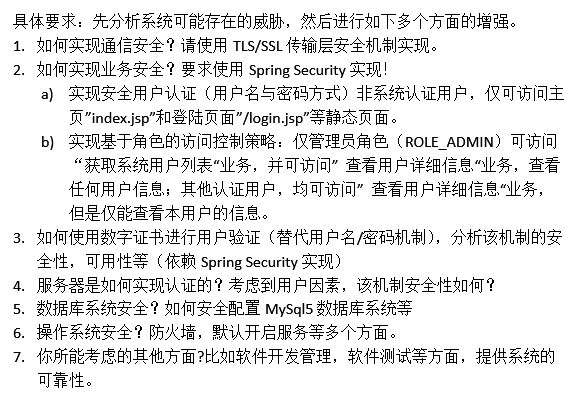

# Tasks

	

## 1.配置

* 搭应用环境
    * mysql 5
    * tomcat 8.0
    * jdk 1.8
* https配置
    * 自签证书：easyrsa / openvpn
    * tomcat https配置
* 防火墙 端口限制

## 2.代码

Spring MVC + Spring Security

安全提升

OpenVPN + Nginx

HTTPS 自签证书

Spring Security / redis + token

用数字证书替代用户名密码机制

localhost开放，权限限制的数据库账户
盐值 + SHA256

端口限制 
SSH 22
web 8080

mybatis 防 SQL注入

